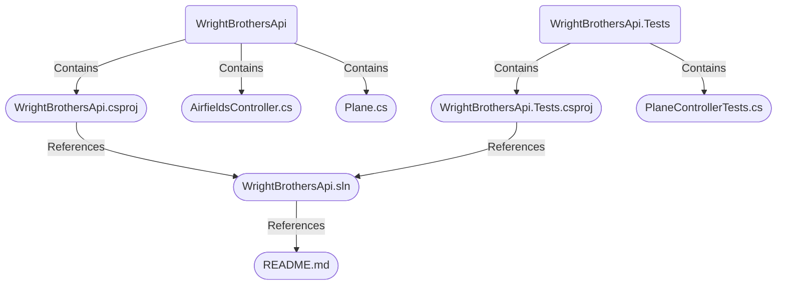

```mermaid
graph TD
    WrightBrothersApi(WrightBrothersApi)
    WrightBrothersApiTests(WrightBrothersApi.Tests)
    WrightBrothersApiCsproj([WrightBrothersApi.csproj])
    WrightBrothersApiTestsCsproj([WrightBrothersApi.Tests.csproj])
    AirfieldsController([AirfieldsController.cs])
    PlaneControllerTests([PlaneControllerTests.cs])
    Plane([Plane.cs])
    WrightBrothersApiSln([WrightBrothersApi.sln])
    README([README.md])
    
    WrightBrothersApi -->|Contains| WrightBrothersApiCsproj
    WrightBrothersApi -->|Contains| AirfieldsController
    WrightBrothersApi -->|Contains| Plane
    WrightBrothersApiTests -->|Contains| WrightBrothersApiTestsCsproj
    WrightBrothersApiTests -->|Contains| PlaneControllerTests
    WrightBrothersApiCsproj -->|References| WrightBrothersApiSln
    WrightBrothersApiTestsCsproj -->|References| WrightBrothersApiSln
    WrightBrothersApiSln -->|References| README
```